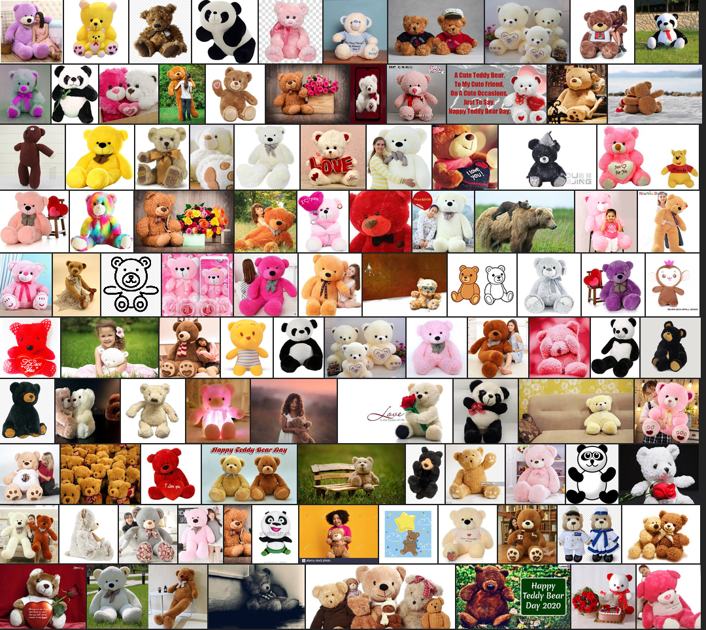
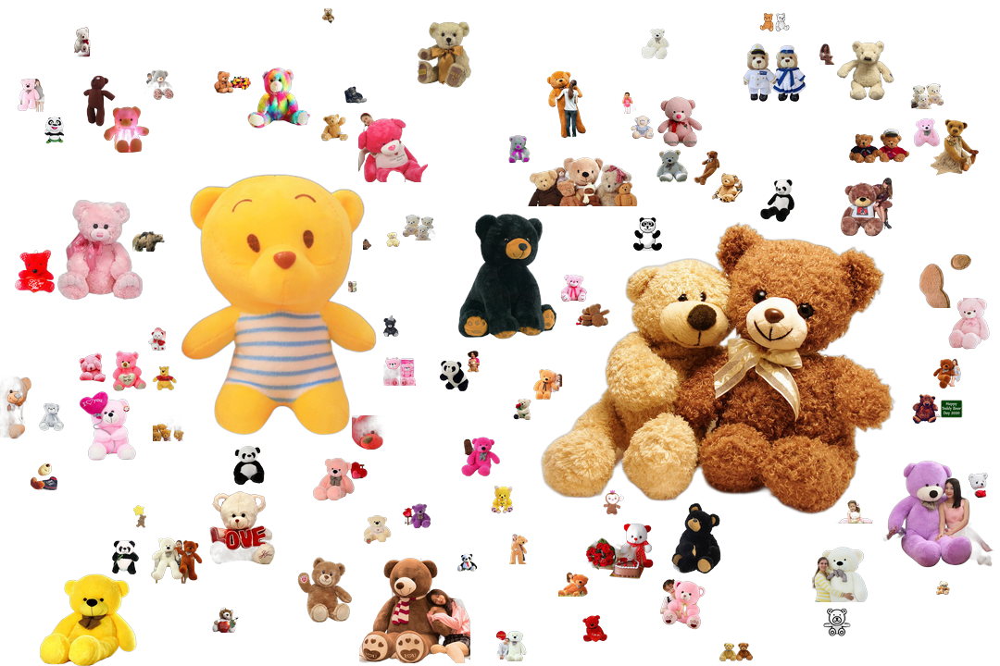
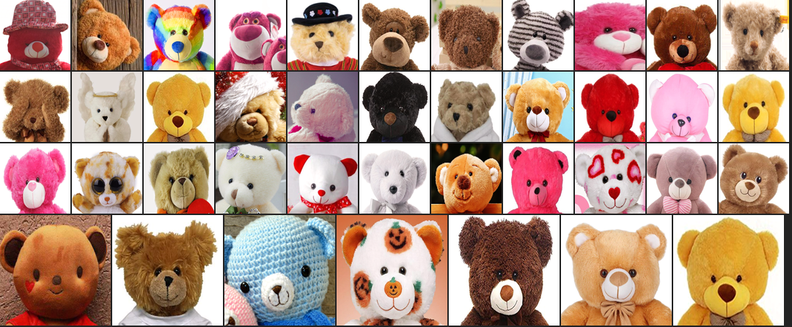

# Teddy Bear Images Dataset #

This repository contains details and downloads links of teddy bear images scraped from google photos searching various keywords related to a teddy bear.

After little cleaning on scraped images, the dataset comprises of 6112 images of a teddy bear at various resolutions in various format(png, jpg and jpeg).

- Collage made from randomly picked images from dataset. Size of image in collage doesn't represent actual image size.

- After removing background, images are greedily packed into canvas.

- Used custom Yolo model to detect faces from raw images and then resized into 256x256 pixels. Teddy bear face dataset comprises of 4992 images of faces in png format.
- Manually labelled faces from 456 teddy bear images. Images and bounding boxes of the face are available in Yolo format. 
- Upscaled face images into 1024x1024 pixels using ESRGAN and 637 images were sampled based on PSNR value. Above collage contains randomly pick upscaled face images.

| | Download Link |
| :--- | :---:        |
|Raw images zip | [Link](https://drive.google.com/uc?id=1O407cVF6BqFfcOUSO3JC6lQIyZchPgGp)|
| Faces in 256x256 zip | [Link](https://drive.google.com/uc?id=1_dnp7ybNWWEzY3iy22KP8y64Cwi9Wj7S) |
| Images with faces bbox labels zip | [Link](https://drive.google.com/uc?id=1EEV-NY4kdVawPF68vNMggt11E-6N87jy) |
| Faces in 1024x1024 zip |[Link](https://drive.google.com/uc?id=1KD8_X1TRYIb48mp_BLcIhbhiVmgCwShO) |

## Acknowledgements

- For faces detection, used [Darknet framework](https://github.com/AlexeyAB/darknet) for training of yolo model 
- For image upscaling, used [BasicSR](https://github.com/xinntao/BasicSR)'s ESRGAN pretrained model
- For background removal, used [U-2-Net](https://github.com/NathanUA/U-2-Net) pretrained model 
- For greedy image packing, [Mosaic](https://github.com/qnzhou/Mosaic)

## Disclaimer

- I do not own any of this images. If copy-right of any of images belong to you, please [contact](https://levindabhi.github.io/#contact) me for removal.

 
